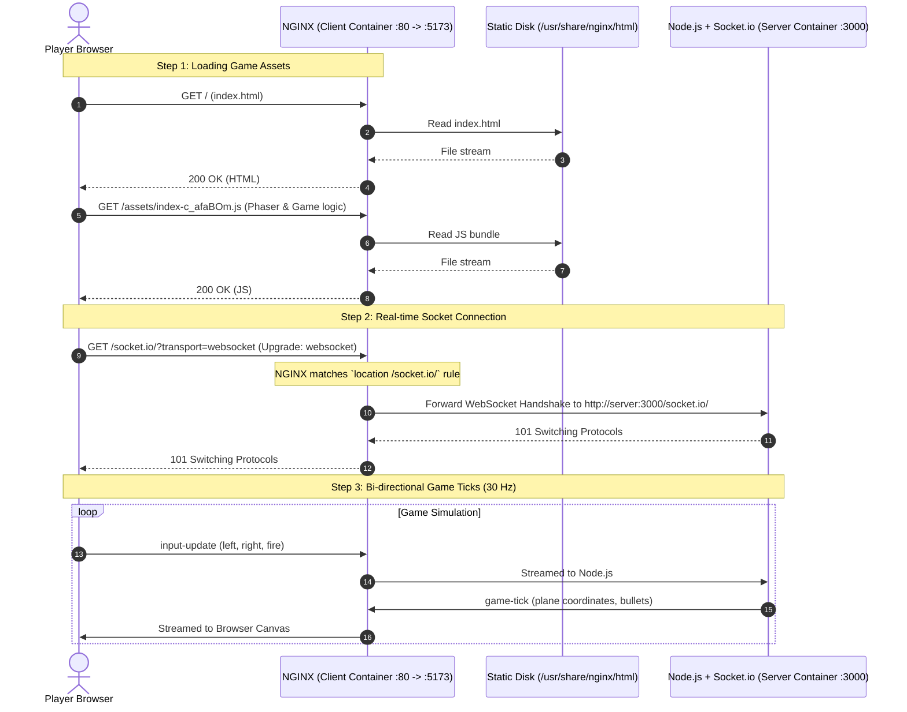

# Deep Dive: NGINX and Its Role in DOGFIGHT

## 1. What is NGINX?

**NGINX** (pronounced *"engine-x"*) is an open-source, high-performance HTTP web server, reverse proxy, load balancer, and HTTP cache. 

Created in 2004 by Igor Sysoev to solve the **C10k problem** (handling 10,000 concurrent client connections on a single server), NGINX is built around an **asynchronous, non-blocking, event-driven architecture**. Instead of spawning a new thread or process for each connection (which consumes heavy memory and CPU context switching), a single NGINX worker process can handle thousands of concurrent requests simultaneously with minimal memory overhead (often under 20–30 MB).

---

## 2. Core Concepts: Web Server vs. Reverse Proxy

NGINX typically performs two main duties:

```
                      ┌────────────────────────────────────────┐
                      │              NGINX                      │
                      │                                        │
User Browser  ───────►│  1. Web Server (Static Content)       │────► Disk (/usr/share/nginx/html)
                      │     Serves HTML, CSS, JS, Images       │
                      │                                        │
                      │  2. Reverse Proxy (Dynamic & Sockets)  │────► Internal Server (Node.js :3000)
                      │     Routes /socket.io/ & /health       │
                      └────────────────────────────────────────┘
```

### A. Static Web Server
When your frontend code is compiled (via `npm run build`), Vite bundles all TypeScript, Tailwind styles, and Phaser game logic into static files:
* `index.html`
* `assets/index-[hash].js`
* `assets/index-[hash].css`
* Game assets (sprites, sounds, tilesets)

A static web server has one job: quickly read these files from the filesystem and transmit them to the user's browser over HTTP. NGINX is industry standard for this because it uses Linux kernel-level file transfer optimizations (`sendfile`) that bypass user-space memory buffers.

### B. Reverse Proxy
A **forward proxy** sits in front of clients (e.g., a VPN hiding client IPs).  
A **reverse proxy** sits in front of servers, acting as a single front door for clients.

Clients only ever talk to the reverse proxy. The reverse proxy inspects the request URL and forwards it to the correct backend service behind the scenes.

---

## 3. Why Do We Use NGINX in DOGFIGHT?

In local development outside Docker:
* Vite runs on `http://localhost:5173` (with its own built-in dev server).
* Node/Express runs on `http://localhost:3000`.

However, in **production and Docker containerization** (`docker-compose.yml`):

1. **We don't want a heavy Node.js or Vite process for static files:**
   Running Vite in production is bad practice—Vite is a development server. Building static files and serving them with `nginx:alpine` results in an ultra-lightweight container (~25MB) with rock-solid stability and zero CPU overhead.

2. **Single Port Access (No CORS or Port Confusion):**
   Without NGINX acting as a reverse proxy, users would have to access the game on port `5173` for the UI, but configure their client to talk directly to `http://your-server-ip:3000` for WebSockets. This exposes internal ports and causes Cross-Origin Resource Sharing (CORS) complexity.  
   With NGINX, the user connects to **one single port (`5173` or `80`)** for everything: the web page, the API, and the real-time game sockets.

---

## 4. The Request Lifecycle in DOGFIGHT

Here is how traffic flows through the system:



---

## 5. Anatomy of Our `nginx.conf`

Here is the exact configuration file we created in `packages/client/nginx.conf`:

```nginx
server {
    listen 80;
    server_name localhost;

    # 1. SERVE STATIC FRONTEND
    location / {
        root /usr/share/nginx/html;
        index index.html index.htm;
        try_files $uri $uri/ /index.html;
    }

    # 2. REVERSE PROXY FOR REAL-TIME WEBSOCKETS
    location /socket.io/ {
        proxy_pass http://server:3000/socket.io/;
        proxy_http_version 1.1;
        proxy_set_header Upgrade $http_upgrade;
        proxy_set_header Connection "upgrade";
        proxy_set_header Host $host;
        proxy_cache_bypass $http_upgrade;
        proxy_read_timeout 86400s;
        proxy_send_timeout 86400s;
    }

    # 3. REVERSE PROXY FOR HEALTH CHECKS
    location /health {
        proxy_pass http://server:3000/health;
        proxy_set_header Host $host;
    }
}
```

### Why Each Directive Matters:

| Directive | Purpose |
| :--- | :--- |
| `location /` | Matches all standard web requests (`/`, `/assets/style.css`, etc.) and serves them from the local dist folder (`/usr/share/nginx/html`). |
| `try_files $uri $uri/ /index.html;` | Single-Page Application (SPA) fallback. If a user refreshes on `/#lobby=123` or a subpath, NGINX routes it back to `index.html` instead of giving a 404. |
| `location /socket.io/` | Intercepts all traffic intended for real-time multiplayer networking. |
| `proxy_pass http://server:3000/socket.io/;` | Forwards the socket traffic across Docker's internal DNS network to the `server` container on port 3000. |
| `proxy_http_version 1.1;` | **Critical for WebSockets.** HTTP/1.0 does not support persistent connections or protocol upgrades. |
| `proxy_set_header Upgrade $http_upgrade;` | Tells the backend server that the client wants to transition from HTTP to the WebSocket protocol. |
| `proxy_set_header Connection "upgrade";` | Instructs the intermediate connection to switch protocols to WebSocket. |
| `proxy_read_timeout 86400s;` | By default, NGINX closes idle connections after 60 seconds. In a multiplayer game lobby, players might wait for friends. Setting this to 24 hours (`86400s`) prevents NGINX from unexpectedly severing the WebSocket connection. |

---

## 6. What Caused the Earlier 404 Error?

When you initially launched Docker:
1. The client container ran the default `nginx:alpine` image.
2. Default NGINX only had a rule for `/`, pointing to `/usr/share/nginx/html`.
3. When the browser loaded the game, Phaser and Socket.io tried to connect to `http://localhost:5173/socket.io/?...`.
4. NGINX looked for a file on its filesystem at:
   `/usr/share/nginx/html/socket.io/index.html`
5. That file obviously did not exist, so NGINX returned:
   `404 Not Found (2: No such file or directory)`.

By providing `packages/client/nginx.conf` with the `location /socket.io/` proxy block, NGINX now recognizes that `/socket.io/` is not a file, but an active WebSocket pipe to the Node backend!
