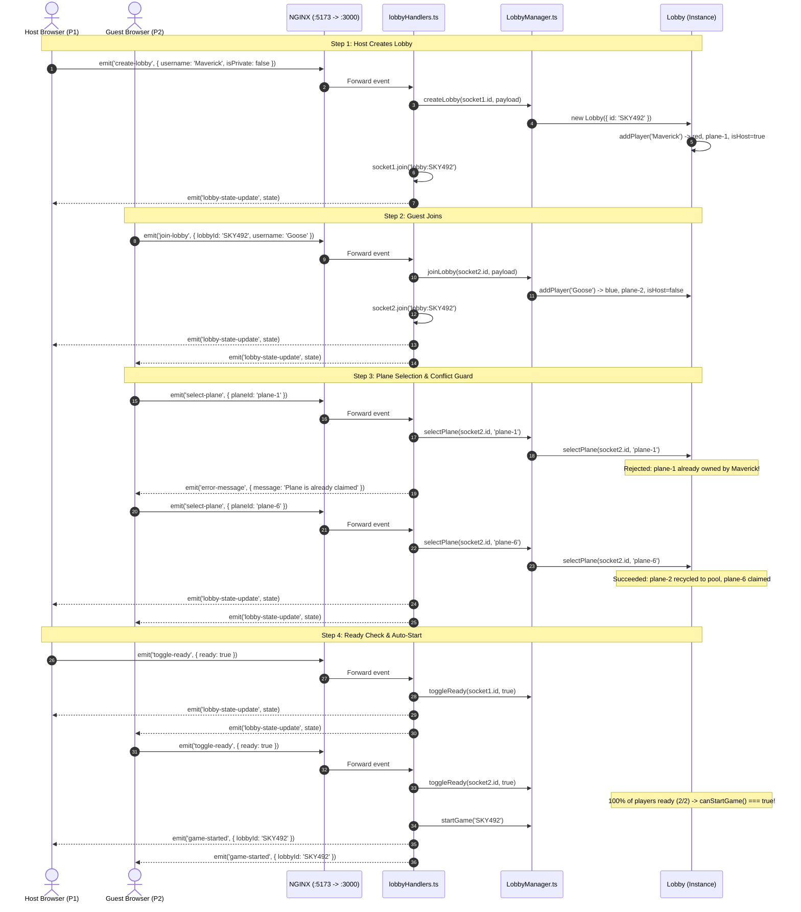

# DOGFIGHT: Sockets & Lobby Architecture Guide

This document explains how WebSockets are created, used, and disposed of across the DOGFIGHT codebase, and details the separation of concerns between `Lobby`, `LobbyManager`, and `lobbyHandlers`.

---

## 1. High-Level Architecture & Layering

The multiplayer lobby system follows a clean **3-layer architecture**:

```
┌────────────────────────────────────────────────────────────────────────┐
│                        TRANSPORT LAYER (Socket.io)                     │
│               packages/server/src/socket/lobbyHandlers.ts              │
│                                                                        │
│  - Listens to incoming socket events ('create-lobby', 'select-plane') │
│  - Manages Socket.io rooms: socket.join('lobby:ABC123')               │
│  - Broadcasts room state (io.to(...).emit) & catches errors           │
└──────────────────────────────────┬─────────────────────────────────────┘
                                   │ delegates domain actions
                                   ▼
┌────────────────────────────────────────────────────────────────────────┐
│                      STORE / AGGREGATOR LAYER                          │
│               packages/server/src/lobby/LobbyManager.ts                │
│                                                                        │
│  - Stores all active lobbies: Map<lobbyId, Lobby>                      │
│  - Indexes player sockets: Map<socketId, lobbyId>                      │
│  - Garbage-collects empty lobbies when all players leave               │
│  - Filters joinable rooms for the public lobby browser                 │
└──────────────────────────────────┬─────────────────────────────────────┘
                                   │ owns and mutates
                                   ▼
┌────────────────────────────────────────────────────────────────────────┐
│                        DOMAIN ENTITY LAYER                             │
│                  packages/server/src/lobby/Lobby.ts                    │
│                                                                        │
│  - Manages single match state: players, password hash, ready flags     │
│  - Enforces rules: unique planes pool, color pool, capacity (max 4)    │
│  - Evaluates auto-start condition: >= 2 players && 100% ready          │
│  - Pure business logic: completely decoupled from Socket.io            │
└────────────────────────────────────────────────────────────────────────┘
```

---

## 2. WebSockets: Creation, Usage, and Disposal

### A. Where are Sockets Created?

There are two sides to every WebSocket connection: the **server listener** and the **client connection**.

#### 1. Server-Side
* **Server Setup ([packages/server/src/server.ts](file:///Users/nedimefe/src/dogfight/packages/server/src/server.ts)):**  
  An HTTP server is attached to a Socket.io `Server` instance configured with strongly-typed event signatures:
  ```typescript
  export function createDogfightServer() {
    const app = express();
    const server = http.createServer(app);

    const io = new Server<ClientToServerEvents, ServerToClientEvents>(server, {
      cors: { origin: '*', methods: ['GET', 'POST'] }
    });

    const lobbyManager = new LobbyManager();

    io.on('connection', (socket) => {
      // Individual client socket created upon handshake!
      registerLobbyHandlers(io, socket, lobbyManager);
    });

    return { app, server, io, lobbyManager };
  }
  ```
* **Individual Socket Instances:**  
  Every time a browser connects, Socket.io creates an individual `Socket` instance with a unique `socket.id` (e.g. `"Xk9_2a"`). This socket represents that specific player's full-duplex communication channel.

#### 2. Client-Side
* **Frontend ([packages/client/src/main.ts](file:///Users/nedimefe/src/dogfight/packages/client/src/main.ts)):**  
  The browser creates its socket connection via `socket.io-client`:
  ```typescript
  import { io } from 'socket.io-client';

  // In Docker / Production: connects to same host through Nginx proxy
  export const socket = io({
    transports: ['websocket'],
    autoConnect: true
  });
  ```
* **Integration Tests ([packages/server/test/lobby-simulation.test.ts](file:///Users/nedimefe/src/dogfight/packages/server/test/lobby-simulation.test.ts)):**  
  Creates client sockets against test server port dynamically:
  ```typescript
  const client = io(`http://localhost:${port}`, {
    transports: ['websocket'],
    forceNew: true
  });
  ```

---

### B. Where are Sockets Used?

Sockets are used throughout the lifecycle of the player's connection:

1. **Incoming Requests ([packages/server/src/socket/lobbyHandlers.ts](file:///Users/nedimefe/src/dogfight/packages/server/src/socket/lobbyHandlers.ts)):**
   The server attaches listeners to the client socket:
   ```typescript
   socket.on('create-lobby', (payload) => { ... });
   socket.on('join-lobby', (payload) => { ... });
   socket.on('select-plane', (payload) => { ... });
   socket.on('toggle-ready', (payload) => { ... });
   socket.on('leave-lobby', () => { ... });
   socket.on('get-lobbies', () => { ... });
   ```

2. **Room Subscriptions:**
   When a player enters a room, their socket joins the isolated Socket.io channel:
   ```typescript
   await socket.join(`lobby:${lobby.id}`);
   ```
   This ensures that game updates and chat messages only travel to players inside that specific match.

3. **Outgoing Responses:**
   * **Unicast (Back to Caller Only):**
     ```typescript
     socket.emit('error-message', { message: 'Lobby is full' });
     socket.emit('lobbies-list', publicLobbies);
     ```
   * **Multicast (To All Players in the Same Room):**
     ```typescript
     io.to(`lobby:${lobby.id}`).emit('lobby-state-update', lobby.toState());
     io.to(`lobby:${lobby.id}`).emit('game-started', { lobbyId: lobby.id });
     ```
   * **Broadcast (To All Connected Clients):**
     ```typescript
     io.emit('lobbies-list', lobbyManager.getPublicLobbies());
     ```

---

### C. Where and How are Sockets Disposed?

Improper socket disposal causes **ghost players**, **stale lobbies**, and **memory leaks**. DOGFIGHT handles disposal in three complementary places:

```
Player Closes Tab / Clicks Leave
               │
               ▼
   1. Socket.io detects closure ('disconnecting' / 'leave-lobby')
               │
               ▼
   2. lobbyHandlers calls lobbyManager.leaveLobby(socket.id)
               │
               ▼
   3. Lobby removes player & recycles color + plane model
               │
               ▼
   4. If lobby has 0 players remaining:
      LobbyManager destroys Lobby instance (Map.delete)
```

1. **Explicit Leave (`leave-lobby` event):**
   * The client socket leaves the Socket.io room (`socket.leave(roomName)`).
   * `socket.emit('lobby-left')` confirms departure to the client.
   * `lobbyManager.leaveLobby(socket.id)` cleans up the player and recycles their assets.

2. **Ungraceful Disconnect (`disconnecting` event):**
   * Triggered automatically when the user closes their tab, refreshes, or loses internet connectivity:
     ```typescript
     socket.on('disconnecting', () => {
       const currentLobby = lobbyManager.getLobbyBySocketId(socket.id);
       if (currentLobby) {
         const roomName = getLobbyRoomName(currentLobby.id);
         const result = lobbyManager.leaveLobby(socket.id);

         if (result.lobby && !result.destroyed) {
           io.to(roomName).emit('lobby-state-update', result.lobby.toState());
         }
         broadcastPublicLobbies(io, lobbyManager);
       }
     });
     ```

3. **Memory Garbage Collection (`LobbyManager.ts`):**
   * `playerLobbyIndex.delete(socket.id)` deletes the socket mapping.
   * If `lobby.getPlayerCount() === 0`, `this.lobbies.delete(lobby.id)` unregisters the entire lobby instance, allowing V8 garbage collection to free all memory.

---

## 3. Detailed Responsibilities of the Three Core Classes

| Component | File Path | Core Role | Knows About Sockets? |
| :--- | :--- | :--- | :--- |
| **`Lobby`** | `packages/server/src/lobby/Lobby.ts` | **Domain Entity:** Manages single-match state, room rules, passwords, and plane/color pools. | ❌ No (Socket-agnostic) |
| **`LobbyManager`** | `packages/server/src/lobby/LobbyManager.ts` | **Global Registry:** Stores active lobbies, indexes socket IDs, and cleans up empty rooms. | ❌ No (Uses IDs only) |
| **`lobbyHandlers`** | `packages/server/src/socket/lobbyHandlers.ts` | **Transport Controller:** Wires Socket.io events, manages rooms, emits updates and errors. | ✅ Yes (`io` & `socket`) |

---

### A. `Lobby` (`packages/server/src/lobby/Lobby.ts`)

The `Lobby` class is a **pure domain model**. It has zero knowledge of Socket.io or HTTP. It only knows how a match is configured and whether rules are being followed.

#### Key Responsibilities:
1. **Room Identity & Settings:**
   * Holds `id` (e.g. `SKY492`), human-readable `name`, and privacy flag `isPrivate`.
   * Securely hashes passwords using `crypto.scryptSync` + unique 16-byte salts.
   * Validates passwords in constant time using `crypto.timingSafeEqual` to defeat timing attacks.
2. **Resource Pools (Colors & Planes):**
   * Owns `availableColors: PlayerColor[]` (`red`, `blue`, `green`, `yellow`).
   * Owns `availablePlanes: PlaneId[]` (`plane-1` through `plane-11`).
   * When a player joins, takes the first available color and plane.
   * When a player selects an unassigned plane model, returns their old plane to `availablePlanes` and claims the new one.
   * Prevents two players from ever having the same plane model in the match.
3. **Player State & Spawns:**
   * Stores `Map<string, PlayerState>` holding username, color, planeId, spawn coordinates, and ready status.
   * Reassigns host privileges (`isHost`) to the next player if the creator leaves.
4. **Auto-Start Evaluation:**
   * `toggleReady(socketId, ready)`: updates player's ready flag.
   * `canStartGame()`: returns `true` if and only if:
     $$\text{playerCount} \ge 2 \quad \text{AND} \quad \text{all connected players have ready} == \text{true}$$
   * `startGame()`: permanently locks plane selections and forbids new players from joining an active match.
5. **Serialization:**
   * `toState(): LobbyState` for room broadcasts.
   * `toSummary(): LobbySummary` for public lobby listings (safely omitting sensitive password data).

---

### B. `LobbyManager` (`packages/server/src/lobby/LobbyManager.ts`)

`LobbyManager` is the **aggregate store**. It manages the lifecycle of all lobbies running on the server.

#### Key Responsibilities:
1. **Lobby Lifecycle:**
   * `createLobby()`: Generates collision-free 6-character room codes, instantiates `new Lobby(...)`, and indexes the creator.
   * `joinLobby()`: Finds lobby by code (case-insensitive e.g. `sky492` or `SKY492`), checks password, adds player.
   * `leaveLobby()`: Removes player. If the room has 0 players left, automatically calls `this.lobbies.delete(lobbyId)` to prevent memory leaks.
2. **$O(1)$ Reverse Indexing:**
   * Maintains `playerLobbyIndex: Map<socketId, lobbyId>`.
   * When a socket message arrives, `getLobbyBySocketId(socket.id)` instantly resolves which lobby the player belongs to without iterating through all rooms.
3. **Public Directory:**
   * `getPublicLobbies()`: Filters all active rooms where `!isPrivate && !isGameStarted` and returns their summaries for lobby browser screens.

---

### C. `lobbyHandlers` (`packages/server/src/socket/lobbyHandlers.ts`)

`lobbyHandlers` is the **glue layer (controller)** that connects the Socket.io network transport to the `LobbyManager`.

#### Key Responsibilities:
1. **Event Listening:**
   * Registers event listeners on the client's `socket`:
     * `create-lobby`
     * `join-lobby`
     * `leave-lobby`
     * `select-plane`
     * `toggle-ready`
     * `get-lobbies`
     * `disconnecting`
2. **Socket.io Room Subscriptions:**
   * Automatically groups sockets by lobby code:
     ```typescript
     await socket.join(`lobby:${lobby.id}`);
     ```
   * Ensures socket departs room on leave:
     ```typescript
     await socket.leave(`lobby:${lobby.id}`);
     ```
3. **Event Broadcasting & Error Handling:**
   * Catches errors thrown by `Lobby` or `LobbyManager` (e.g. *"Lobby is full"*, *"Invalid password"*, *"Plane already claimed"*) and routes them back to the caller as:
     ```typescript
     socket.emit('error-message', { message: err.message });
     ```
   * Dispatches state updates to all room occupants:
     ```typescript
     io.to(roomName).emit('lobby-state-update', lobby.toState());
     ```
   * Triggers the match when auto-start conditions are satisfied:
     ```typescript
     io.to(roomName).emit('game-started', { lobbyId: lobby.id });
     ```
   * Broadcasts updated public lobby summaries to global clients browsing for matches:
     ```typescript
     io.emit('lobbies-list', lobbyManager.getPublicLobbies());
     ```

---

## 4. End-to-End Sequence Diagram

Here is the complete event lifecycle when two players create a match, select planes, mark ready, and start the game:



---

## 5. Summary Cheat Sheet

* **Sockets created:**  
  Server creates `io` on startup in [server.ts](file:///Users/nedimefe/src/dogfight/packages/server/src/server.ts); individual `socket` instances are spawned upon client handshake in `io.on('connection')`. Client creates `socket` in [main.ts](file:///Users/nedimefe/src/dogfight/packages/client/src/main.ts).
* **Sockets used:**  
  Inside [lobbyHandlers.ts](file:///Users/nedimefe/src/dogfight/packages/server/src/socket/lobbyHandlers.ts) to receive client actions, join Socket.io rooms (`lobby:${id}`), and emit room-wide state updates.
* **Sockets disposed:**  
  When tabs close or players leave: [lobbyHandlers.ts](file:///Users/nedimefe/src/dogfight/packages/server/src/socket/lobbyHandlers.ts) catches `disconnecting`, calls `lobbyManager.leaveLobby(socket.id)`, and unregisters empty rooms to prevent memory leaks.
* **`Lobby`:**  
  The room's rule engine and data model (passwords, capacity, unique planes, ready check).
* **`LobbyManager`:**  
  The multi-room store ($O(1)$ socket-to-room index, room garbage collection, lobby browser).
* **`lobbyHandlers`:**  
  The network controller translating Socket.io events into business logic calls and room broadcasts.
